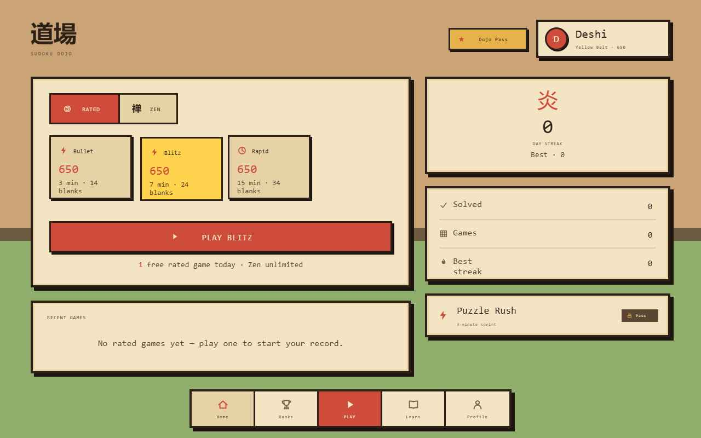

# 数独道場 — Sudoku Dojo

A pixel-art Sudoku app prototype where **every puzzle is Elo-rated and matched to your skill**, like chess.com for Sudoku. Built as a single interactive HTML prototype in a retro "Pixel Dojo" visual style (cream washi paper, hard pixel shadows, hanko seals, tatami floor).



## Concept

Sit, breathe, solve. Rather than static "easy/medium/hard", Sudoku Dojo treats Sudoku like a competitive rated game: you earn a rating by playing, climb a belt rank (White → Sensei), and every puzzle is matched to where you are.

## Features

- **Two ways to play**
  - **Rated** — chess-style time controls (**Bullet** 3 min · **Blitz** 7 min · **Rapid** 15 min), each with its *own* rating and a countdown clock that fails you on timeout.
  - **Zen** — relaxed difficulty levels (Beginner → Expert), no clock, no rating, no pressure.
- **Real difficulty** — modes genuinely differ in blank count, hint budget, and time pressure.
- **Rating & belts** — start from a familiarity question, then gain/lose Elo per game (provisional swings for your first solves); earn belt ranks and **hanko-stamp achievements**.
- **Interactive grid** — keyboard + pad entry, pencil notes, hints, undo, erase, mistake tracking.
- **Teaching loop** — fail a puzzle and the dojo suggests the technique it needed, with an interactive lesson (Naked Single → X-Wing).
- **Leaderboard** — global / friends ranks with belt swatches.
- **Profile** — circular avatar, per-control rating list, rating-history sparkline, stats, and achievement stamps.
- **Monetization** — freemium with a **Dojo Pass** tier (gates shown, never hidden; no ads).
- **Sound design** — generated WebAudio SFX: felt-tip pen, pencil, eraser, page-turn hints, temple-bell win.

## Running

Production app built per [`SPEC.md`](SPEC.md): React 18 + TypeScript (strict) · Vite · Tailwind v3 · Zustand · React Router v6 · Framer Motion · Web Audio.

```bash
npm install
npm run dev      # http://localhost:5173
npm run build    # typecheck + production build to dist/
npm run test     # engine unit tests (generator, solver, difficulty, Glicko-2)
```

### Backend (optional)

The app runs fully in **guest mode** (localStorage + mock checkout) with zero setup.
To enable real backends, copy `.env.example` → `.env` and fill in:

- **Supabase** (`VITE_SUPABASE_URL`, `VITE_SUPABASE_ANON_KEY`) — auth + Postgres + Realtime.
  Schema is in [`SPEC.md`](SPEC.md#supabase-schema).
- **Stripe** (`VITE_STRIPE_PUBLISHABLE_KEY`) — Embedded Checkout (needs a backend session endpoint).

When the keys are absent, `src/lib/supabase.ts` and `src/lib/stripe.ts` transparently fall back.

## Structure

```
src/
  engine/      generator · solver (constraint-prop + backtrack) · difficulty
               (technique-weighted Elo) · rating (Glicko-2) · techniques
  stores/      Zustand: game · player · settings · auth · leaderboard
  audio/       Web Audio engine + synthesized sound definitions
  components/  Grid · Cell · NumberPad · BeltBadge · HankoStamp ·
               Sparkline · UpgradePrompt · Icon · PixelButton · Nav
  screens/     Onboarding · Home · Play · Profile · Leaderboard ·
               Techniques · Paywall
  lib/         constants (belts, achievements, time controls, gates) ·
               supabase · stripe
  styles/      tokens.css (Pixel Dojo design tokens)
```

## Status

Playable end-to-end against the local engine: real puzzle generation with
guaranteed-unique solutions, Glicko-2 rating updates (player + puzzle), belts,
achievements, streaks, freemium gates, and interactive technique lessons.
Auth and payments fall back to guest/mock until Supabase/Stripe keys are provided.
